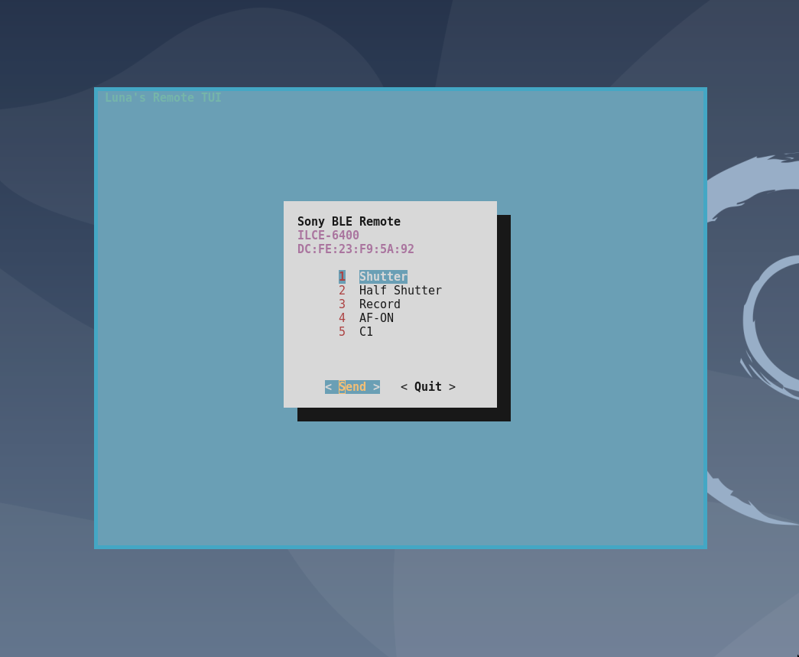

# Sony Camera BLE Remote Control TUI

This is a simple script to control a Sony camera over Bluetooth using just
`bluetoothctl` and `dialog`.

It uses the reverse engineering work done by https://github.com/coral/freemote/ and https://gregleeds.com/reverse-engineering-sony-camera-bluetooth/.

## The TUI

## The CLI

This tool can also be used in a non-interactive context via the CLI.

`./sony-ble-remote.sh help`

